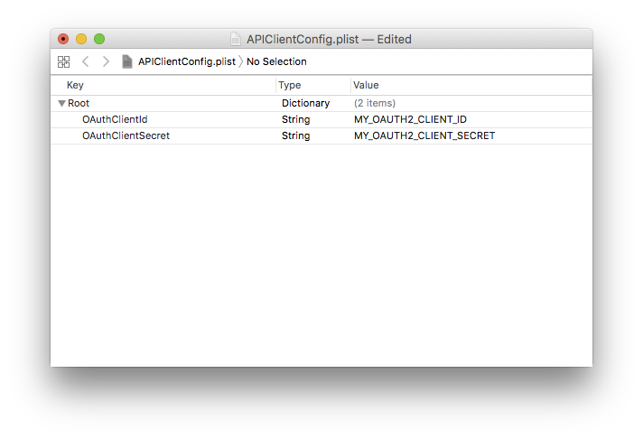

# Examples

## AferoLab

AferoLab is a simple app that demonstrates connecting to the Afero Cloud,
and basic device interaction. In order to run AferoLab, you'll have to
first configure APIClientConfig.plist. 
Depending on your setup with Afero you will have either: 
  * OAuth2 Client ID and Secret 
  or 
  * OAuth2 Client ID, auth/token url, redirect url, api hostname and authenticator cert.

### OAuth2 Client Configuration

First, place the APIClientConfig file:
```shell
cd AferoLab/AferoLab
cp APIClientConfig-EXAMPLE.plist APIClientConfig.plist
or 
cp APIClientConfig-EXAMPLE2.plist APIClientConfig.plist

open APIClientConfig.plist
```

Second, open the file and add your client config:



Third, save the file, and run the app.
